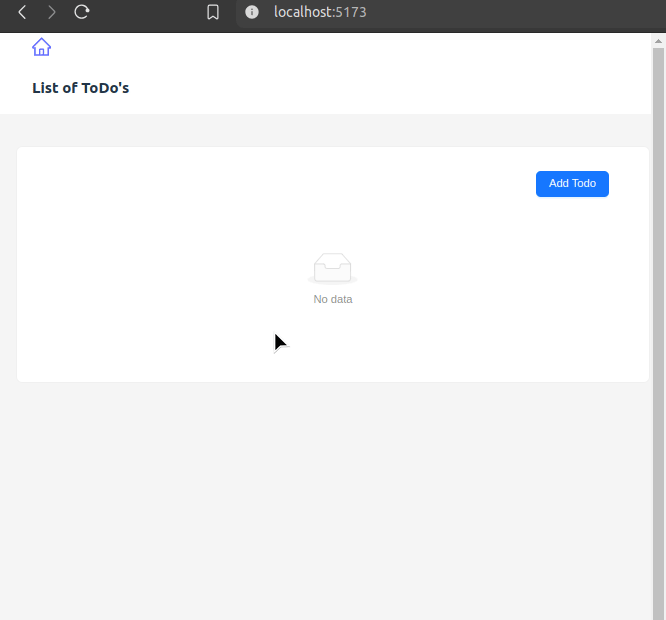

<h1 align="center">Simple CRUD app with REACT</h1>

<p align="center">

This is a React CRUD project by ambax/Artūrs Melnis.

Simple ToDo list app featuring creating ToDo records, deleting and editing Todo records as well as viewing the record adding comments to it, deleting and editing comments.
</p>

<h2>Features</h2>
<p align="center">
    
    
    
    
</p>
<p align="center">
    
</p>
<h2 align="center">Setup</h2>

- ```git clone https://github.com/ambivalent-axiom/react-to-do-app.git``` Clone the Repository
- ```npm install``` Install Dependencies
- ```npm run dev``` Build Frontend
- ```php run server``` Serve the Application
- Open ```localhost:5173``` in web browser.

<h2 align="center">Contact</h2>
If you have any questions or feedback, feel free to reach out:<br>
Email: artmelnis@gmail.com
